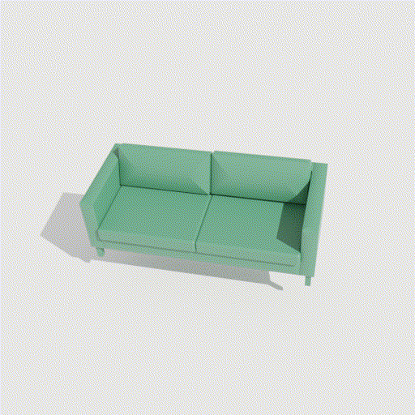

# Blender_vis


one script show some simple fancy rendering effect.


Demo 


#### generate gif from rendered image
```
ffmpeg \
 -framerate 30 \
 -pattern_type glob \
 -i '*.png' \
 -r 15 \
 -vf scale=512:-1 \
 out.gif
 ```
